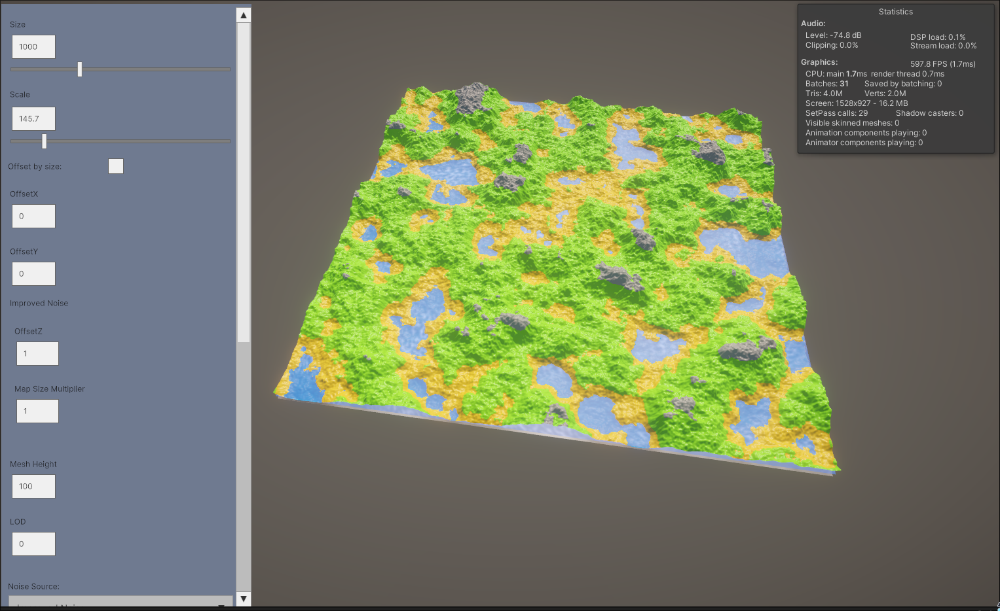
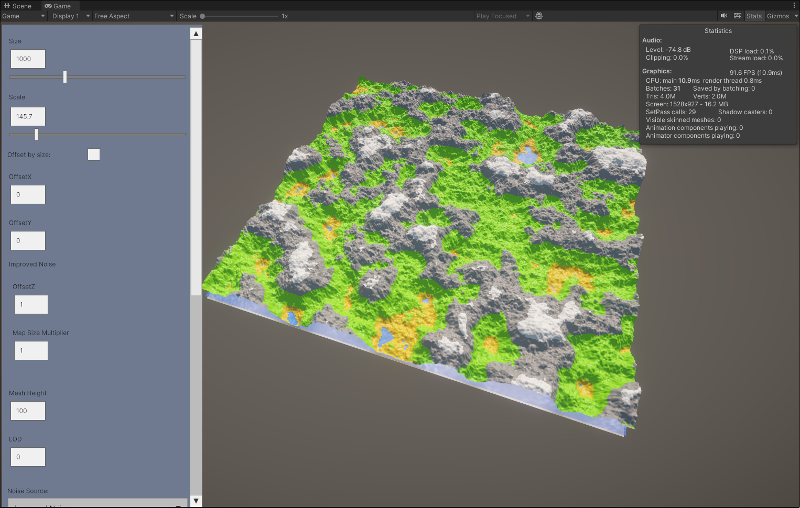

# PTG_U

Procedural Terrain Generation in Unity by using Perlin Noise in combination with Fractal Brownian Motion.

## Preview

</img>
</img>
</img>

## Generation parameters

- Noise source:
    - Unity - Mathf.PerlinNoise
    - Improved Noise - Implementation of Improved Noise (3D) based on [reference implementation](https://mrl.cs.nyu.edu/~perlin/noise/)
- Size - Square mesh size
- Scale - Noise scale
- Offset by Size - Offsetting by noise map size
- Noise X offset
- Noise Y offset
- Fractal Brownian Motion params:
 - Amplitude
 - Frequency
 - Persistence
 - Lacunarity
 - Octave count
- Mesh Height - Max mesh height for noise value of 1
- Mesh LOD - Level of detail
- Water Plane Threshold - Water plane Y position based on mesh height
- Use Avg - Averaging surrounding noise map values while generating mesh  
- Ease function -  use the fade/ease function (`6t^5 - 15t^4 + 10t^3`) on generated noise values
- Application of custom curve to generated noise values
- Colors - array of height/noise value thresholds with colors to apply to generated mesh
- Mesh coloring shader(Cshader):
 - Texture - Coloring mesh based on the noise value 
 - Height - Coloring mesh based on height value

For Improved Noise aditionaly:
 - Noise Z offset
 - Permutation table mutiplayer - to manipulate the size of the base permutation table to allow for minimizing repetition of generated terrain
 - Randomazing the noise permutation table

## Features

- Runtime and in-editor UI.
- Auto-updating mesh on changes in Editor or in Runtime UI.
- Mesh exporting - generated terrain meshes can be exported to an ASCII PLY file by clicking the export mesh button.
- Noise plane - quick overiew of generated noise map.
- Water plane.

## License

This project is licensed under [MIT](LICENSE) License.
